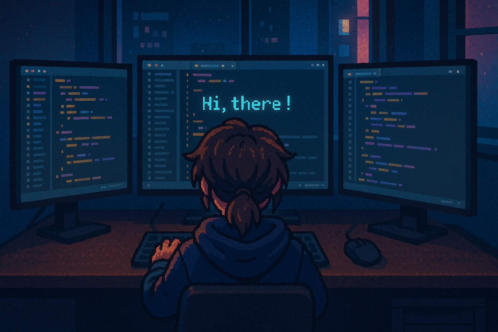

  🧑‍💻 Junior Developer | 🎓 42 School Student | 🐧 Linux Enthusiast

  

<h2 align="center">🚀 About Me</h2>

- 🏫 Recently finished the core curriculum at **42 School**
- 👨‍💻 Rewinding Java and diving into Kotlin to return to mobile app development — building on past experience with Java mobile dev.
- 🧠 Always learning new tools and technologies
- 🔧 Interested in backend, software & mobile development

    
<h2 align="center">🔧 Technologies & Tools</h2>

  

<h2 align="center">🏆 My Stats</h2>

&nbsp;&nbsp;
    &nbsp;&nbsp;

### 📫 Let's Connect

---

_✨ I’m just getting started, and always open to learning more!_
